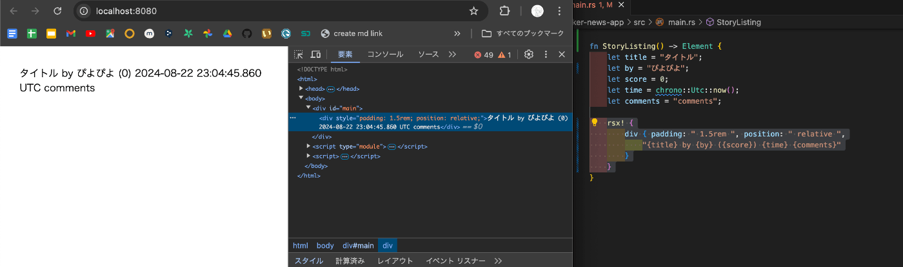

# wasm 完全に理解した（い）

2024/08/23

ふみふみ

---

# 対象者

- Rust **読めない**
- Wasm **知らない、使ったことない**

---

# 目的

- Wasm は便利
- Java Script と他の言語を組み合わせて使える

と認識して帰ってもらうこと

---

# wasm とは

なんか Rust で使える技術らしい。

文献をあさってみる

---

# WebAssembly.org

## https://webassembly.org/

> WebAssembly (略称 Wasm ) は、スタックベースの仮想マシン用のバイナリ命令形式です。Wasm は、プログラミング言語のポータブルなコンパイル ターゲットとして設計されており、クライアントおよびサーバー アプリケーションを Web 上で展開できるようにします。

---

# MDN

## [WebAssembly の概要 - WebAssembly | MDN](https://developer.mozilla.org/ja/docs/WebAssembly/Concepts)

> WebAssembly は最近のウェブブラウザーで動作し、新たな機能と大幅なパフォーマンス向上を提供する新しい種類のコードです。基本的に直接記述ではなく、C、C++、Rust 等の低水準の言語にとって効果的なコンパイル対象となるように設計されています。

> ウェブ上で動作するクライアントアプリで従来は実現できなかった、ネイティブ水準の速度で複数の言語で記述されたコードをウェブ上で動作させる方法を提供します。

---

# つまり Wasm とは

- WebAssembly（略称：Wasm） とは、**C、C++、Rust などを Web ブラウザ上で実行できるコードのこと**。
- **WebAssembly モジュールをウェブアプリに組み込んで、JavaScript 経由で他の場所から利用できる**

...らしい。

---

# 何が嬉しいのか

参考：[WebAssembly の概要 - WebAssembly | MDN](https://developer.mozilla.org/ja/docs/WebAssembly/Concepts)

- 高速、効率的、ポータブル

  - 異なるプラットフォーム間で使える
  - 機械語並の速さで実行可能

- 可読性もある
  - 人が読めるテキスト形式がある
  - ＝デバッグできる

など

（Wasm は絶賛仕様策定中）

---

# 機械語？ネイティブ？

[ネイティブコードとは - 意味をわかりやすく - IT 用語辞典 e-Words](https://e-words.jp/w/%E3%83%8D%E3%82%A4%E3%83%86%E3%82%A3%E3%83%96%E3%82%B3%E3%83%BC%E3%83%89.html)

> ネイティブコード（native code）とは、コンピュータの CPU（MPU/マイクロプロセッサ）が理解できる形式で記述されたコンピュータプログラム。プロセッサに対する命令の仕様を定義した機械語（マシン語）で書かれており、人間が直接読み書きすることは困難である。

---

# つまり何が嬉しいの？

- 機械語並みの速さを実現できる
- でも人間もちゃんと読める

---

## 何ができるのか

[Rust から WebAssembly にコンパイル - WebAssembly | MDN](https://developer.mozilla.org/ja/docs/WebAssembly/Rust_to_Wasm)

- アプリケーション**全体**の構築
  - ウェブアプリ全体を Rust ベースで構築する
  - ex; [Dioxus | An elegant GUI library for Rust](https://dioxuslabs.com/)
- アプリケーションの**一部の**構築
  - 既存の JavaScript フロントエンドの内部で Rust を使用する
  - TypeScript によく似た [AssemblyScript](https://www.assemblyscript.org/) を用いて、 WebAssembly バイナリーに出力もできる

---

# 実際にやってみる

- Rust
- Dioxus
  - Rust のライブラリ
  - React コンポーネントのような物を Rust でかける

---

# コード

```rs
use dioxus::prelude::*;

fn main() {
    launch(App);
}

pub fn App() -> Element {
    rsx! { StoryListing {} }
}

fn StoryListing() -> Element {
    let title = "タイトル";
    let by = "ぴよぴよ";
    let score = 0;
    let time = chrono::Utc::now();
    let comments = "comments";

    rsx! {
        div { padding: " 1.5rem ", position: " relative ",
            "{title} by {by} ({score}) {time} {comments}"
        }
    }
}
```

---

# 解説します

---

# main()

- `use` はライブラリの読み込み
- `App`コンポーネントを `main()`関数で呼び出し

```rs
use dioxus::prelude::*;

fn main() {
    launch(App);
}
```

---

# App()

- App コンポーネント
- `StoryListing`というコンポーネントを返すだけ

```rs
pub fn App() -> Element {
    rsx! { StoryListing {} }
}
```

---

# StoryListing()

- コンポーネントの本体
- スタイリングされた `div` タグを返すだけ
- `div` タグの中身は変数で定義した内容

```rs
fn StoryListing() -> Element {
    let title = "タイトル";
    let by = "ぴよぴよ";
    let score = 0;
    let time = chrono::Utc::now();
    let comments = "comments";

    rsx! {
        div { padding: " 1.5rem ", position: " relative ",
            "{title} by {by} ({score}) {time} {comments}"
        }
    }
}
```

---

# 結果


---

## まとめ

- wasm は Web Assembly の略
- 機械語並みの速さで実行できる Web アプリケーションを作れる

---

## 余談：この LT で外部に出ます

[エンジニア達の「完全に理解した」Talk 　#56 - connpass](https://easy2.connpass.com/event/326820/) に、今日と同じ内容で出ます

目指せﾁｮｯﾄﾃﾞｷﾙ

---



---

## 参考文献

- [ネイティブコードとは - 意味をわかりやすく - IT 用語辞典 e-Words](https://e-words.jp/w/%E3%83%8D%E3%82%A4%E3%83%86%E3%82%A3%E3%83%96%E3%82%B3%E3%83%BC%E3%83%89.html)
- [WebAssembly](https://webassembly.org/)
- [WebAssembly の概要 - WebAssembly | MDN](https://developer.mozilla.org/ja/docs/WebAssembly/Concepts)
- [Wasm と Docker の比較 | Docker](https://www.docker.com/ja-jp/blog/wasm-vs-docker/)

---

# Wasm 何もわからない

ご清聴ありがとうございました

---

wasm 書かれて → JavaScript → Wasm 実行
